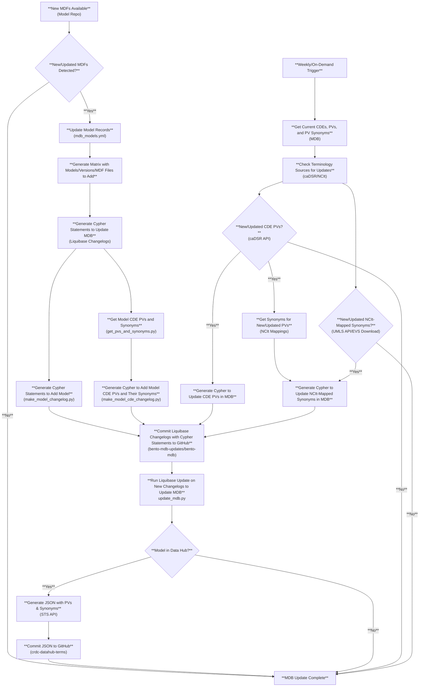

# MDB Updates

The following diagram maps out the system components and processes:

```mermaid
flowchart TD
    %% Primary Update Flow
    A["**New MDFs Available**<br/>(Model Repo)"] --> B{**New/Updated MDFs Detected?**}
    B -- **Yes** --> C["**Update Model Records**<br/>(mdb_models.yml)"]
    B -- **No** --> J[**MDB Update Complete**]
    C --> C1[**Generate Matrix with Models/Versions/MDF Files to Add**]
    C1 --> D["**Generate Cypher Statements to Update MDB**<br/>(Liquibase Changelogs)"]
    D --> D1["**Generate Cypher Statements to Add Model**<br/>(make_model_changelog.py)"]
    D --> D2["**Get Model CDE PVs and Synonyms**<br/>(get_pvs_and_synonyms.py)"]
    D2 --> D3["**Generate Cypher to Add Model CDE PVs and Their Synonyms**<br/>(make_model_cde_changelog.py)"]
    D1 & D3 --> E["**Commit Liquibase Changelogs with Cypher Statements to GitHub**<br/>(bento-mdb-updates/bento-mdb)"]
    E --> F[**Run Liquibase Update on New Changelogs to Update MDB**<br/>update_mdb.py]
    F --> G{**Model in Data Hub?**}
    G -- **Yes** --> H["**Generate JSON with PVs & Synonyms**<br/>(STS API)"]
    H --> I["**Commit JSON to GitHub**<br/>(crdc-datahub-terms)"]
    I --> J
    G -- **No** --> J

    %% Secondary Update Flow (Weekly/On-Demand)
    K[**Weekly/On-Demand Trigger**] --> L["**Get Current CDEs, PVs, and PV Synonyms**<br/>(MDB)"]
    L --> M["**Check Terminology Sources for Updates**<br/>(caDSR/NCIt)"]
    M --> V{"**New/Updated CDE PVs?**<br/>(caDSR API)"}
    M --> N{"**New/Updated NCIt-Mapped Synonyms?**<br/>(UMLS API/EVS Download)"}
    V -- **Yes** --> W1["**Get Synonyms for New/Updated PVs**<br/>(NCIt Mappings)"]
    V -- **Yes** --> W2["**Generate Cypher to Update CDE PVs in MDB**"]
    W2 --> E
    W1 --> P["**Generate Cypher to Update NCIt-Mapped Synonyms in MDB**"]
    P --> E
    V -- **No** --> J
    N -- **Yes** --> P
    N -- **No** --> J

```